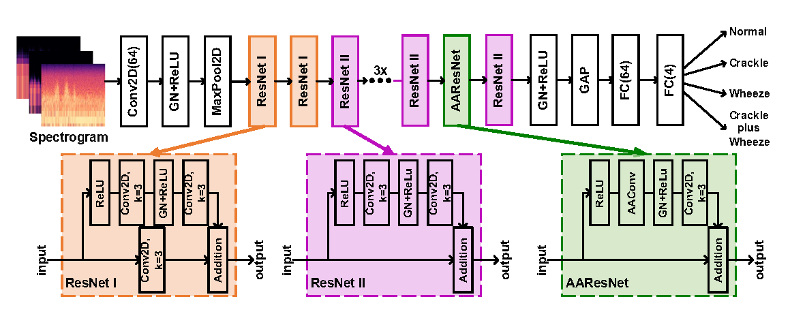
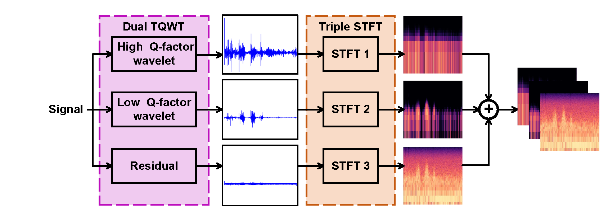
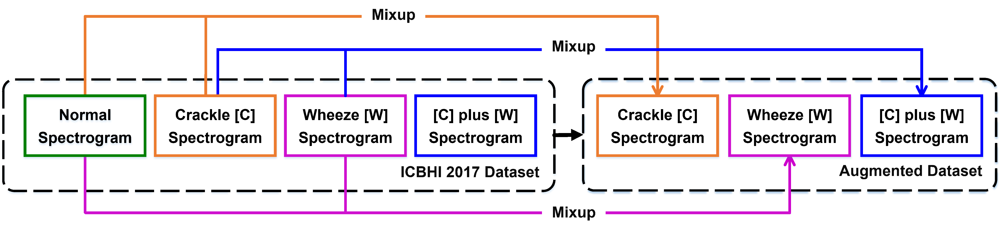
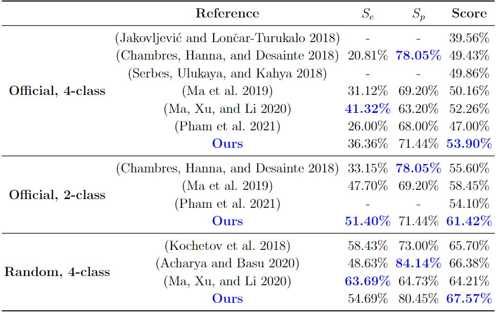
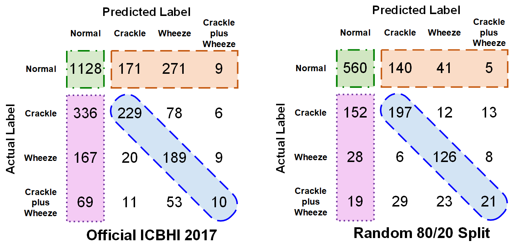

# LungAttn
This repository contains the LungAttn for lung sound deep learning classification model, published in [this paper](https://pubmed.ncbi.nlm.nih.gov/34534977/).

<!-- TABLE OF CONTENTS -->
## Table of Contents

* [LungAttn](#LungAttn)
  * [Pre-processing](#Pre-processing)
  * [Data Augmentation](#Data Augmentation)
  * [Train](#Train)
  * [Performance](#Performance)
* [Author](#Author)
* [License](#License)

## LungAttn

The architecture of our LungAttn model. The input is a 3-channel spectrogram after tunable-Q wavelet transform (TQWT) and short time Fourier transform (STFT)

## Pre-processing

In order to train the model, you need to download ICBHI 2017 database [here](https://bhichallenge.med.auth.gr/). Each sample provided by this database contains several breath cycles. So you need to clip them according to the start and end time declared officialy. Then you need to divide them into train set and test set. Here we divide them based on official suggestion.

The class to clip samples and divide database are concluded in
```
LungAttn/pre-processing/tqwt_stft.py
```
named `clip_cycle` and `clip_test` respectively.

After that, we implement tunable-Q wavelet transform (TQWT) to decompose the original lung sound and short time Fourier transform (STFT) to convert the audio into spectrograms. 

You can run
```
LungAttn/pre-processing/tqwt_stft.py
```
to store the spectrograms as pictures locally. Then
```
LungAttn/pre-processing/pm_pack.py
```
helps you to store spectrograms and corresponding labels into `.p` file.

## Data Augmentation

To eliminate the imbalanced problem of ICBHI 2017 dataset, we implement mixup data augmentation method. 


The implementation of mixup method is included in 
```
LungAttn/model/LungAttn.py
```
named `mixup_data`.

## Train

The model was built using PyTorch, please read detail in 
```
LungAttn/model/LungAttn.py
```
To run the model, you can use the command
```
python3 model/LungAttn.py \
--lr 0.1 \
--gpu 0 \
--nepochs 100 \
--input ../pack/official/tqwt1_4_train.p \
--test ../pack/official/tqwt1_4_test.p \
--batch_size 32 \
--mixup True \
> log/outfile/myout.file 2>&1&
```

## Performance

Comparison with state-of-the art works:



Confusion matrix:



## Authors

* **Jizuo Li** 
* **Jiajun Yuan** 
* **Hansong Wang** 
* **Shijian Liu** 
* **Qianyu Guo** 
* **Yi Ma**
* **Yongfu Li***
* **Liebin Zhao***
* **Guoxing Wang**

## License

Please cite these papers if you have used part of this work.
```
Li J, Yuan J, Wang H, et al. LungAttn: advanced lung sound classification using attention mechanism with dual TQWT and triple STFT spectrogram[J]. Physiological Measurement, 2021, 42(10): 105006.
```